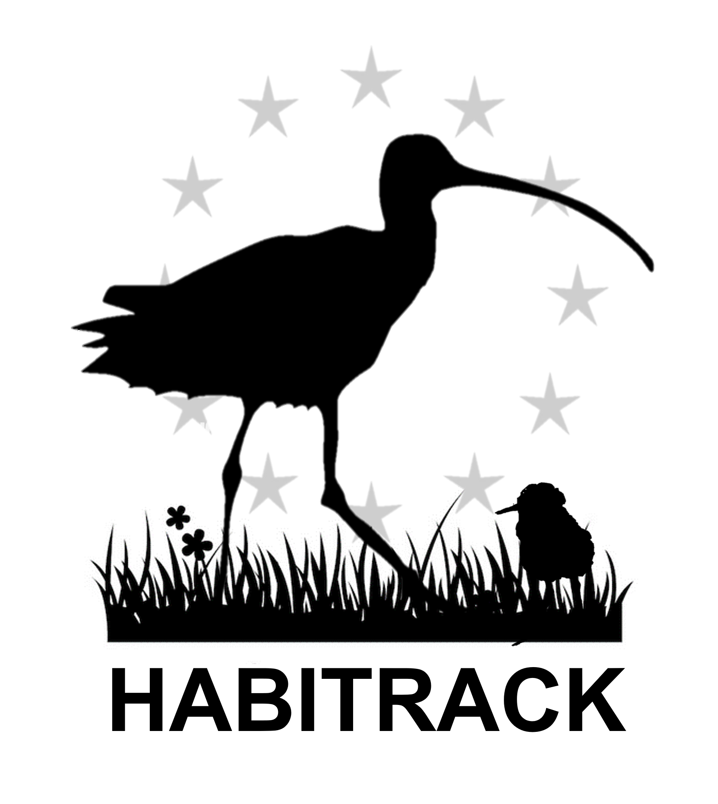

# **Migration and stationary sites**

MoveApps

Github repository: <https://github.com/janhanz/BreedWinterStop>

## Description

An algorithm distinguishing migration from stationary (non-migration) records in GPS tracks of migratory birds. Stationary records are further classified into wintering grounds, breeding grounds, and stopover sites.

## Documentation

The App was developed for the purpose of automated detection of breeding sites, wintering sites, and stopovers in multiyear GPS tracking data of migratory birds investigated in the [HABITRACK](https://habitrack.eu/?lang=en) project.

The algorithm uses either the speed between consecutive records or ground speed derived from GPS devices to run K-means clustering to distinguish between migration and stationary records in the tracks. Stationary records are then classified into breeding grounds and wintering grounds based on the information on bird status when tagged. The user supplies whether the bird was tagged on (or closer to) breeding grounds or wintering grounds. Alternatively, WGS84 coordinates of the bird's nest can be supplied. This information allows K-means analysis to distinguish blocks of breeding and wintering records. Those blocks being shorter than the user defined minimum period of stay in the breeding and wintering grounds are subsequently assigned to stopover sites. Additional steps include DBSCAN clustering to split incoherent blocks of stationary records and reassign outlying stopover records to migration to increase the precision of data classification.

### Application scope

#### Generality of App usability

This App was developed to identify breeding and wintering grounds and stopover sites in GPS tracking data of Eurasian Curlew (*Numenius arquata*), and was also tested on the tracking data of other bird species in the [HABITRACK](https://habitrack.eu/?lang=en) project. It should be able to distinguish the mentioned stages of the annual cycle in many migratory bird species if the migration movement is distinguished from the stationary stages by clearly different speeds and if the time spent on breeding or wintering grounds is substantially different from the length of stays in stopovers. Otherwise, blocks of breeding or wintering grounds may be distinguished in unexpected locations and needs to be checked manually for their relevancy.

#### Required data properties

The App is designed to use GPS tracking data with a structure as defined in Movebank. The ID of each record (`event_id)` is needed. Optional data can include Horizontal Dilution of Precision (HDOP) as `gps_hdop`, the number of satellites in fix as `gps_satellite_count`, and the ground speed derived from the GPS device as `ground_speed`.

The App may provide acceptable classification results even for data with a lower frequency of fixes around 30 to 60 minutes.

Tracking data including multiple individuals is accepted for classification.

### Input type

`move2::move2_loc` object in Movebank format

### Output type

`move2::move2_loc` object

### Artefacts

`"Input_form.csv"`: CSV file with all parameters defined in Settings. Mandatory for classification of multi-individual tracking data.

`"Classification_records_summary_", bird_ID, ".csv"`: CSV file with a summary of stationary blocks of records. It shows `Bird_ID`, the range of rows (`First_row`, `Last_row`) for each block, number of each block (`Block_nr`), `Block_type` (stationary or migration), `Block_class` (breeding, wintering, stopover sites), `Block_size` (in km), distance to the consecutive stationary block (`Dist_next_stat`, in km), UTC time and calendar date (`Start_date`, `End_date`) and duration of stay in each block (separately in `Days`, `Hours`, and `Minutes`), and WGS84 coordinates (longitude, latitude) of the centroids of the blocks (`Long_centr`, `Lat_centr`), corresponding to the output file.

`"Classification_records_", bird_ID, ".csv"`: CSV file with the complete output. It shows `Bird_ID`, and for each record, block number (`Block_nr`), `Block_type` (stationary or migration), `Block_class` (migration, wintering, breeding, stopover site), `Block_size` (in km), distance to the next record (`Dist_consec`, in m), consecutive and/or ground speed (`Speed_consec` or `Speed_gr`, in m/s), separately the `Year`, `Month`, `Day`, `Hour`, `Minute` and `Second`, the UTC `Timestamp`, and WGS84 coordinates (`Long`, `Lat`).

`"Log_classif_", study_id, ".txt"`: TXT file with log of the classification process.

### Settings

**Prepare classification parameters or run classification** (`prep_class`): Choose if an input form with classification parameters should be prepared, or the form (`Input_form.csv`) is ready for classification. The input form with default settings needs to be reviewed. Note that the input form is not used for clasification of single individual tracking data – then set the parameters below.

**Capture status of a bird** (`cap_status`): Capture status of a bird during tagging. ‘winter’ when tagged on the wintering grounds, ‘breed’ when tagged on the breeding grounds. Birds tagged at stopover sites should be assigned to ‘winter’ if the location is closer to assumed wintering grounds, and ‘breed’ if closer to assumed breeding grounds. Alternatively, nest coordinates can be supplied.

**Nest coordinates** (`nest_coords`): Nest coordinates (longitude, latitude) supplied in decimal format and WGS84 coordinate system, for instance c(Long = 2.3593, Lat = 48.8415). Alternatively, capture status of a bird during tagging can be provided.

**Merge single-row blocks** (`single_blk_merge`): Merge single-row blocks of migration or stationary records with the neighbouring blocks. (default TRUE)

**Ground speed** (`gr_speed`): Use the ground speed measured by GPS device instead of the speed between consecutive records. (default FALSE)

**Bursts in the records** (`bursts_rec`): Preserve bursts in the data, i.e. very frequent records. (default FALSE)

**Maximum reasonable speed of flight** (`max_flight_sp`): The highest reasonable speed of bird flight. The value may be a bit larger than the highest know speed of flight of a given bird species to preserve exceptional but real fast flights. Units: `m/s` (default 40)

**Distance gap between consecutive records** (`dst_stat_gap`): The limit distance between two consecutive stationary records above which the records will be split into two block. Units: `km` (default 30)

**Time gap between consecutive records** (`time_stat_gap`): The limit time between two consecutive stationary records above which the records will be split into two block. Units: `hours` (default 3)

**Distance for distinguishing breeding from wintering grounds** (`centr_dist`): The limit distance below which breeding and wintering grounds are not separated from each other, i.e. the bird did not migrate. Units: `km` (default 50)

**Distance between near (neighbouring) blocks** (`near_blk_dist`): Distance below which two near (neighbouring) blocks of stationary records are merged. Units: `km` (default 20)

**Distance for detection of ‘outlier’ records in stopover blocks** (`near_stop_rec`): Distance above which the neighbouring records in a stopover block are considered ‘outliers’ and reclassified as migratory records. Units: `km` (default 1)

**Minimum number of records in a stopover block** (`clust_min_rec`): Minimum number (\> 1) of records in a stopover block to be checked for ‘outliers’. (default 2)

**Distance for detection of new stationary blocks** (`near_stat_dist`): Distance above which the neighbouring records in a stationary block are assigned to a new block. Units: `km` (default 5)

**Minimum length of a breeding or wintering block** (`br_win_min`): Minimum length of a block of records to be recognized as breeding or wintering grounds. Units: `days` (default 30, i.e. a period a bit longer than the length of the incubation period in Curlew)

**Input form with parameter settings for each individual** (`input_form`): Please upload a single csv file `Input_form.csv` if data on multiple individuals will be classified.

### Changes in output data

The input data is filtered according to the user settings. Classification of the records is added to the input data as the column `class_rec`. It contains classes of breeding ground (`breed`), wintering ground (`winter`), stopover sites (`stopover`), and `migration`.

### Most common errors

The data is too large to fit into memory during the calculation of distance matrices.

Incorrect input settings or invalid combinations of input settings.

### Null or error handling

Memory shortage may be resolved by thinning the data.

Incorrect settings or invalid combinations of the settings result in printing an error message specifying the issues. No output is returned.

### Acknowledgements

Funded by the European Union. Views and opinions expressed are however those of the author(s) only and do not necessarily reflect those of the European Union or the European Research Executive Agency (REA). Neither the European Union nor the granting authority can be held responsible for them.

